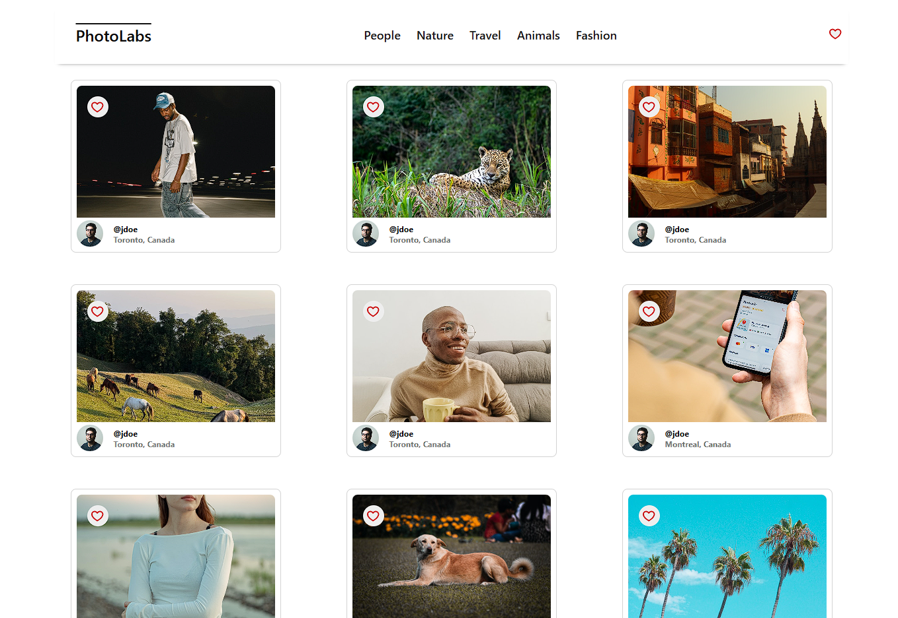
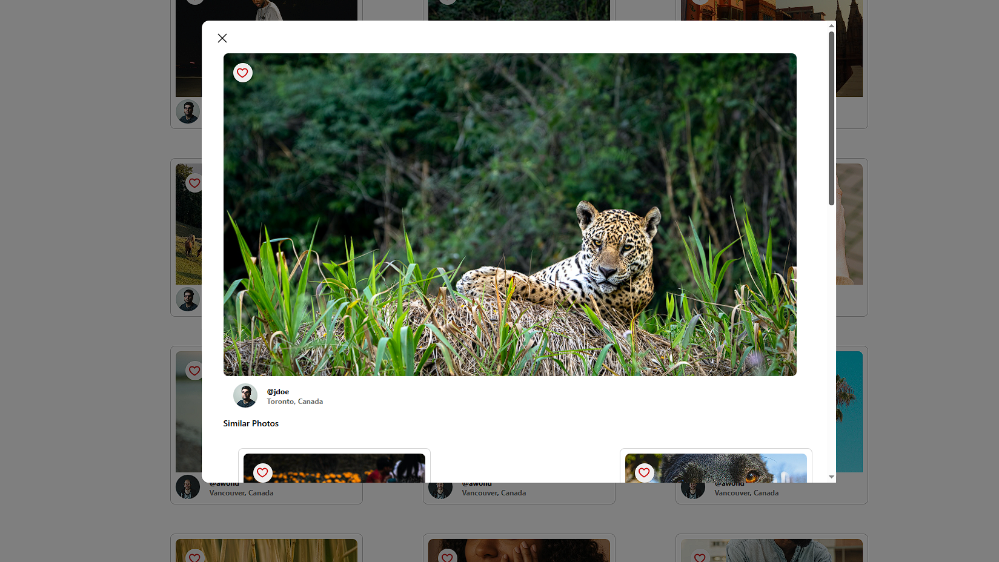

# PhotoLabs

PhotoLabs is a React-based single-page application (SPA) that allows users to browse and interact with a collection of photos. Users can view photos by topics, mark favorites, and explore similar images through a modal interface.

# Features
- **Browse Photos:** View a collection of photos fetched from an API.

- **Filter by Topics:** Select topics to filter the displayed photos.

- **Favorite Photos:** Mark photos as favorites for easy access.

- **View Similar Photos:** Click on a photo to open a modal displaying similar images.

- **Responsive Design:** Enjoy a seamless experience across devices.

# Screenshots





# Getting Started
## Prerequisites
- Node.js and npm installed on your machine.

## Installation
**1. Clone the repository:**
```
git clone https://github.com/Amga20d/photolabs.git
cd photolabs
```
**2. Install dependencies:**

- For the frontend:
```
cd frontend
npm install
```

- For the backend:
```
cd ../backend
npm install
```

## Running the Application
**1. Start the backend server:**
```
cd backend
npm start
```
The backend server will run on http://localhost:8001.

**2.Start the frontend development server:**
```
cd ../frontend
npm start
```
The application will open in your default browser at http://localhost:3000.

## Technologies Used
**Frontend:**

- React

- SASS

- Webpack

- Babel

**Backend:**

- Node.js

- Express

- PostgreSQL

- Socket.io

## Contributing
Contributions are welcome! Please fork the repository and submit a pull request for any enhancements or bug fixes.

License
This project is licensed under the MIT License. See the LICENSE file for more details.

Acknowledgements
Special thanks to Lighthouse Labs for the project guidelines and inspiration.
Thanks to the open-source community for valuable resources and support.
